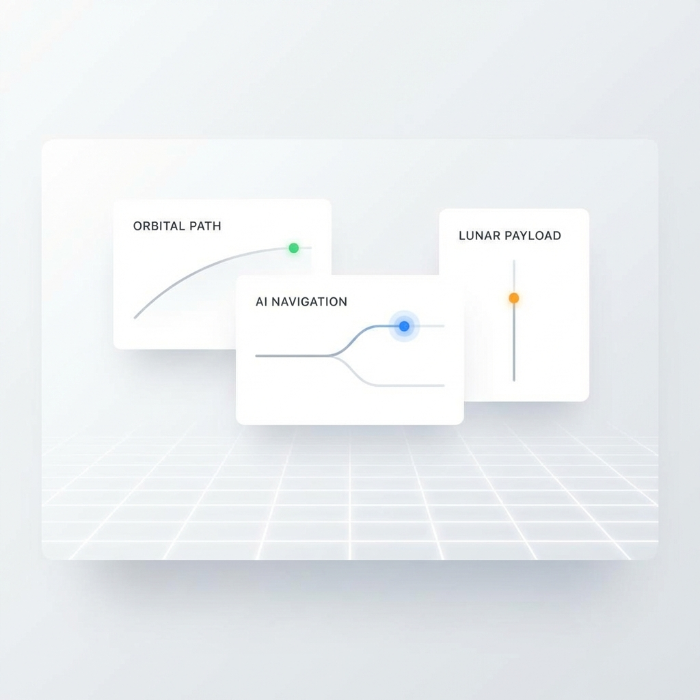

# 🧠 Jarvis - Multi-Agent AI Orchestrator

> **Parlez naturellement, Jarvis orchestre intelligemment.**

[](https://jarvis.atelier-sam.fr)
[](./LICENSE)

---

## ⚡ La Puissance de l'Orchestration

**Dites simplement ce que vous voulez accomplir.**

```
"Refactore le module d'authentification et ajoute des tests"
```

Jarvis analyse votre demande et :
- 🎯 **Décompose** la tâche en sous-tâches logiques
- 🔀 **Délègue** chaque partie à l'agent le plus adapté
- ⚡ **Parallélise** quand c'est possible pour aller plus vite
- ✅ **Agrège** les résultats en une réponse cohérente

**Vous parlez, Jarvis réfléchit et agit.**

---

## 🚀 Comment ça marche ?

### 1. Installez le CLI

```bash
npm install -g jarvis-orchestrator
```

### 2. Parlez naturellement

```bash
jarvis "Analyse ce projet et propose une architecture améliorée"
```

Ou utilisez le mode interactif :
```bash
jarvis chat
> Crée une landing page moderne pour mon SaaS
> Ajoute des animations subtiles
> Optimise pour mobile
```

```bash
jarvis "Analyse ce projet et propose une architecture améliorée"
```

Ou utilisez le mode interactif :
```bash
jarvis chat
> Crée une landing page moderne pour mon SaaS
> Ajoute des animations subtiles
> Optimise pour mobile
```


### 3. Jarvis orchestre automatiquement

```
┌─────────────────────────────────────────────────────┐
│  🧠 JARVIS ORCHESTRATION                            │
├─────────────────────────────────────────────────────┤
│  Analyse: "Landing page SaaS + animations + mobile" │
│                                                     │
│  → Sous-tâche 1: Structure HTML/Layout → Gemini    │
│  → Sous-tâche 2: Animations CSS        → Gemini    │
│  → Sous-tâche 3: Responsive design     → Claude    │
│                                                     │
│  Mode: Swarm (parallèle) - 3 agents actifs         │
└─────────────────────────────────────────────────────┘
```

---

## 🐝 Mode Swarm (Parallélisation)

Pour les tâches complexes, Jarvis active automatiquement le mode Swarm :

- **Plusieurs agents travaillent en parallèle**
- **Chaque agent sur sa spécialité** (UI, logique, tests...)
- **Résultats fusionnés intelligemment**

```bash
# Force le mode swarm pour une tâche
jarvis "Redesign complet du site" --swarm
```

---

## 🎯 Délégation Intelligente

| Type de tâche | Agent optimal | Pourquoi |
|:---|:---|:---|
| UI, CSS, design | Gemini | Rapide, créatif |
| Architecture, logique | Claude | Analytique, précis |
| Tests, debug | Codex | Technique, rigoureux |

Jarvis choisit automatiquement. Ou forcez manuellement :
```bash
jarvis "..." --model gemini:pro
jarvis "..." --model claude:sonnet
```

---

## 🛠️ Commandes CLI

### Commandes de base
```bash
jarvis setup                    # Installe/configure les CLIs AI
jarvis status                   # État des agents + quotas restants
jarvis chat                     # Mode conversation interactif
jarvis "votre demande"          # Exécution directe
```

### Modes avancés
```bash
# 🐝 Swarm - Parallélisation multi-agents
jarvis "redesign complet" --swarm

# 🪞 Reflect - Consensus multi-agents (compare réponses)
jarvis "architecture question" --reflect --agents=3

# 📋 Plan-First - Validation avant exécution
jarvis "refactor module" --plan-first

# 📦 Context Injection - Injecte du contexte fichier
jarvis "ajoute loading state" --include src/Stats.tsx,src/types.ts
```

### Modèles disponibles
```bash
--model gemini:flash     # Rapide (défaut)
--model gemini:pro       # Pro standard
--model claude:sonnet    # Équilibré  
--model claude:opus      # Intelligence max
--model openai:codex     # Tests/Debug
```

---

## 🔗 Intégration GitHub

Créez des issues GitHub directement depuis le dashboard Jarvis :
- Lien automatique entre tâches Jarvis et issues GitHub
- Synchronisation bidirectionnelle du statut

---

## 📊 Dashboard (Optionnel)

Suivez vos projets et quotas sur [jarvis.atelier-sam.fr](https://jarvis.atelier-sam.fr)

<p align="center">
  
</p>

---

## 📋 Prérequis

- **Node.js 18+**
- **Au moins un CLI AI :**
  - [Gemini CLI](https://github.com/google/gemini-cli)
  - [Claude CLI](https://github.com/anthropics/claude-cli)
  - [Codex CLI](https://github.com/openai/codex-cli)

---

## 📝 License

MIT - [LICENSE](./LICENSE)

---

<div align="center">
  <sub>🏔️❤️ En train de faire une côte, vive l'aventure 🏔️❤️</sub>
  <br>
  <sub>par Sam Sam</sub>
</div>
