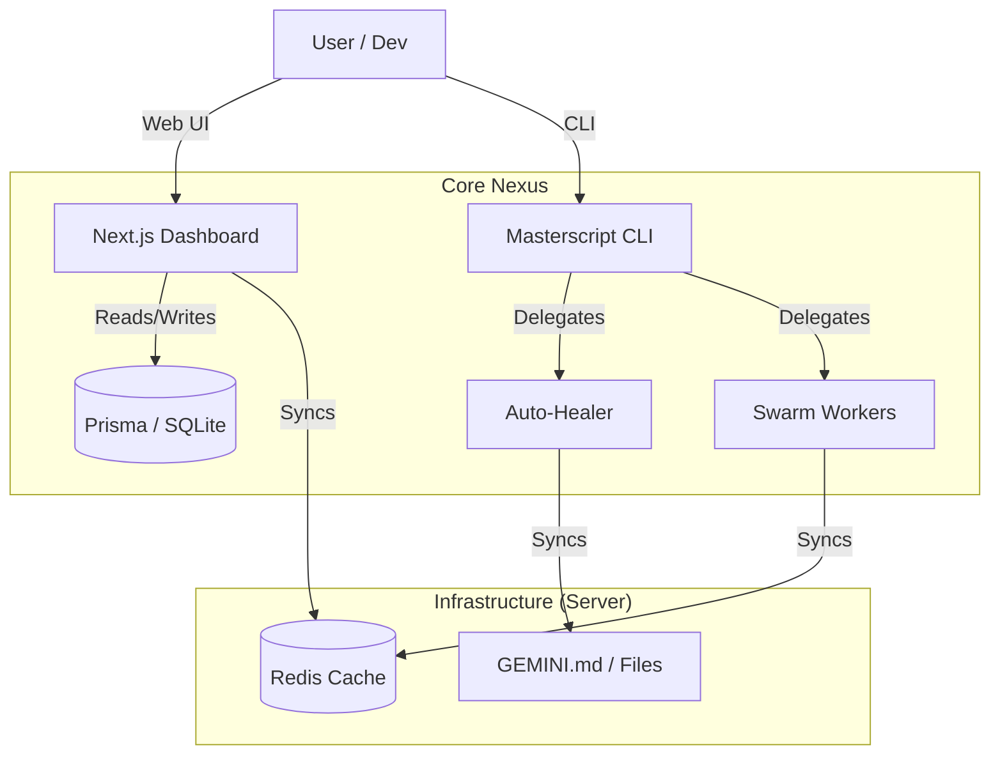

# 🧠 Jarvis AI Nexus


> **Centralized AI Orchestration Nexus for Antigravity, Gemini, and Codex.**
> Jarvis acts as the intelligent bridge between your development environment, AI agents, and shared memory infrastructure.

---

## 📸 Dashboard

<p align="center">
  
  <br>
  <em>Real-time agent monitoring and task delegation dashboard.</em>
</p>

---

## 🚀 Quick Start (Zero-Config)

Get your AI orchestration up and running in moments.

1.  **Clone & Setup**
    ```bash
    git clone https://github.com/your-username/jarvis-nexus.git
    cd jarvis-nexus
    npm install
    ```

2.  **Start the Dashboard**
    ```bash
    npm run dev
    # Opens the Web UI at http://localhost:3000
    ```

3.  **Explore Documentation**
    *   [Getting Started Guide](./docs/GETTING_STARTED.md)
    *   [CLI Reference](./docs/CLI_REFERENCE.md)
    *   [Self-Hosting Guide](./docs/SELF_HOSTING.md)

---

## ✨ Key Features

*   **🧠 Centralized Shared Memory**
    `GEMINI.md` acts as the single source of truth, synced across all your devices via Server/Redis. Never lose context again.

*   **🔄 Multi-Machine Sync**
    Seamlessly switch between Mac, PC, and Laptop. Your project state, chat history, and context follow you automatically.

*   **🤖 Intelligent Delegation**
    Saves premium model quota (Opus) by delegating routine tasks (linting, docs, simple refactors) to specialized, lower-cost agents (Gemini CLI, Codex).

*   **❤️‍🩹 Auto-Healing Codebase**
    The `auto-healer` script watches your files. You code; it fixes imports, types, and syntax errors in the background.

*   **🐝 Swarm Workers**
    Orchestrate multiple AI workers (Gemini, ChatGPT, Claude) simultaneously through a unified interface.

*   **📊 Interactive Dashboard**
    A modern Next.js 15 web interface to monitor agent status, manage tasks, and visualize system architecture.

---

## 🏗️ Architecture

Jarvis is built on a robust, distributed architecture designed for flexibility and persistence.



### Tech Stack
*   **Frontend:** Next.js 15, React 19, Tailwind CSS, Framer Motion
*   **Backend:** Node.js, Prisma, Redis
*   **AI Models:** Google Gemini, OpenAI (Codex/GPT-4), Anthropic (Claude 3.5 Sonnet/Opus)
*   **DevOps:** Docker, Shell Scripts

---

## 🛠️ Usage & Scripts

| Command | Description |
| :--- | :--- |
| `npm run dev` | Starts the Jarvis Web Dashboard (Next.js). |
| `npm run delegate` | Launches the Masterscript to delegate tasks to agents. |
| `npm run healer:watch` | Starts the auto-healer in watch mode. |
| `npm run verify` | Runs a comprehensive health check on the codebase. |
| `./sync.sh` | Pushes local changes and context to the central server. |
| `./pull.sh` | Pulls the latest memory and state from the central server. |

---

## 🤝 Contributing

We welcome contributions to make Jarvis smarter and more efficient!

1.  **Fork** the repository.
2.  **Clone** your fork locally.
3.  **Create a branch** for your feature: `git checkout -b feature/my-new-feature`.
4.  **Commit** your changes with clear messages.
5.  **Push** to your fork: `git push origin feature/my-new-feature`.
6.  **Open a Pull Request** against the main repository.

Please ensure your code follows our linting rules and passes all tests before submitting.

---

## 📄 License

Distributed under the **MIT License**. See `LICENSE` for more information.

---

<div align="center">
  <sub>Built with ❤️ by Atelier Sam & the AI Swarm</sub>
</div>
